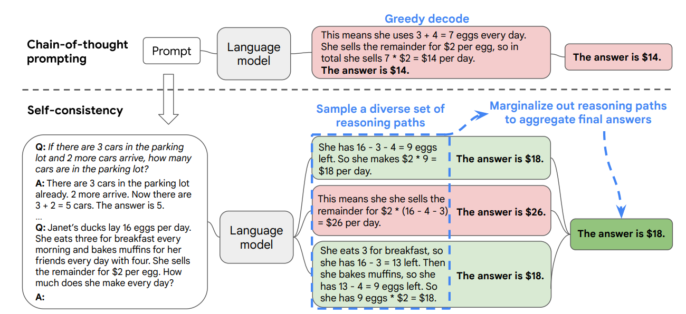

# 使用 LLM 對生成結果評分

## 參考資料

論文位置: [https://arxiv.org/abs/2406.12845](https://arxiv.org/abs/2406.12845)

範例程式: [https://github.com/RLHFlow/RLHF-Reward-Modeling/](https://github.com/RLHFlow/RLHF-Reward-Modeling/)

模型下載: [https://huggingface.co/RLHFlow/ArmoRM-Llama3-8B-v0.1](https://huggingface.co/RLHFlow/ArmoRM-Llama3-8B-v0.1)


## 架構說明

使用 ArmoRM-Llama3-8B-v0.1 做為評估模型

<figure><figcaption></figcaption></figure>


## 評分方式

### 輸入

Prompt : 輸入的問題

```
'What are some synonyms for the word "beautiful"?'
```

Response : 生成的答案

```
"Nicely, Beautifully, Handsome, Stunning, Wonderful, Gorgeous, Pretty, Stunning, Elegant"
```

messages : 依據格式準備

```python
messages = [{"role": "user", "content": prompt},
           {"role": "assistant", "content": response}]
```

### 輸出

支援 19 個項目評估

```python
'helpsteer-helpfulness','helpsteer-correctness','helpsteer-coherence',
'helpsteer-complexity','helpsteer-verbosity','ultrafeedback-overall_score',
'ultrafeedback-instruction_following', 'ultrafeedback-truthfulness',
'ultrafeedback-honesty','ultrafeedback-helpfulness','beavertails-is_safe',
'prometheus-score','argilla-overall_quality','argilla-judge_lm','code-complexity',
'code-style','code-explanation','code-instruction-following','code-readability'
```

其中支援 `HelpSteer dataset`的五種評估

```python
helpfulness, correctness, coherence, complexity, verbosity
```


## 範例

隨機抽取`HelpSteer dataset`做為範例

### 範例輸入

```python
prompt = 'What are some synonyms for the word "beautiful"?'
response = "Nicely, Beautifully, Handsome, Stunning, Wonderful, Gorgeous, Pretty, Stunning, Elegant"
```

### 翻例輸出

```python
# [helpfulness, correctness, coherence, complexity, verbosity]
標籤 : [3,3,4,2,2] 
模型 : [2.7812, 2.8398, 3.4844, 1.3945, 1.3262]
```

