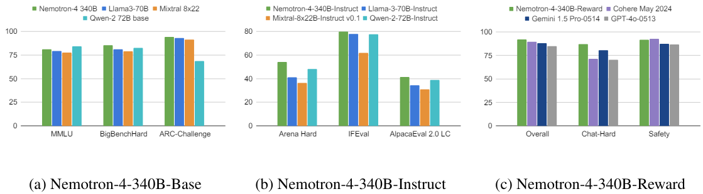

# 使用大型文字語言模型生成合成數據

## 1. Introduction

### 合成數據的需求與研究背景

* **研究目的**
  * 探討是否可以透過大型語言模型（LLMs），生成高效的合成數據來替代傳統的數據收集方法。
  * 希望能減少數據收集的成本和時間。

### **高質量的訓練數據的重要性**

* 高質量的訓練數據
  * 對於文本分類模型的性能至關重要。
  * 然而收集和整理這些數據既耗費時間又昂貴。
* 合成數據生成
  * 雖然生成的合成數據可以大幅降低成本，但其效果可能不如實際數據。
  * 合成數據在不同任務間的應用效果存在變異，這也是需要克服的一大挑戰。

## 2. Related Work

### 生成式AI與大型語言模型

* 依賴大型語言模型，如GPT-3.5 Turbo生成高質量的文本數據。
  * 在生成類人類文本方面表現優異且涵蓋多種應用，例如科學數據生成和程式碼生成。
  * 但在特定領域的專業知識上有所不足。

## 3. Methodology

### 零樣本合成數據生成

* **情境設置**：不需要預先存在的數據，使用自定義情境提示設置上下文。
  * IMDB 電影評論分類任務中的提示為 : 「假設你是IMDB平台上的電影評論家」。
* **數據生成提示**：指導模型生成特定風格、標籤和字數限制的文本。
  * 生成帶有 「 正面 」 或 「 負面 」 情感的電影評論。
* **多樣性提示**：每生成n個數據點後提供多樣性提示以增加數據多樣性。
  * 與先前產生的資料相比，您能提供更多樣化的東西嗎？

### 少樣本合成數據生成

* 使用少量實際數據作為示例，輔助大型語言模型生成合成數據。
  * 生成的數據更具有多樣性和實效性。
* 需要真實數據作為參考，並限制不要單純改寫。
  * 在指導 LLM 生成每段文本之前，提供隨機的實際數據範例，並施加約束 「應該模仿我的範例」。

## 4. Evaluation I: Comparison Across Different Types of Tasks

### 代表性任務(10個文字分類任務)

* AG’s news (Zhang et al., 2015)
* IMDB reviews (Maas et al., 2011)
* SMS spam (Almeida et al., 2011)
* Financial phrase bank (Malo et al., 2014)
* Reddit emotion (Demszky et al., 2020)
* Relation classification (Gao et al., 2019)
* Tweet irony speech (Van Hee et al., 2018)
* Tweet emotions (Mohammad et al., 2018)
* Sarcasm news (Misra and Arora, 2023, Misra and Grover, 2021)
* Humor speech (Annamoradnejad and Zoghi, 2020).

### 主觀性對數據效用的影響

* 資料集和文本分類任務的主/客觀說明
  * 新聞主題類別進行分類（例如，如 AG 新聞資料集中的分類）是相對客觀的
  * 文本是否幽默（例如，如幽默語音資料集中的分類）則相當主觀 。
* 主觀性高的任務需要深度理解語境和情感，這超出了目前LLMs的能力，導致其生成的數據在捕捉語言豐富性和細微差異方面表現不足
  * 在低主觀性任務中，合成數據的效能可以接近真實數據。
  * 在高主觀性任務中，合成數據效能顯著下降。

### 合成數據在不同任務上的效用

* 透過實驗評估 LLM 生成的合成數據在10種不同類型的文本分類任務（AG's News, IMDB Reviews ...）中的效用，每位參與者對10個任務進行主觀性判定。
  * 隨機抽取的一對文本分類任務，根據任務描述、標籤描述和示例來判定哪個任務更客觀。
  * 總共獲得了540個成對主觀比較，來確定每個任務的主觀性水平並進行排名。
  * 最終得到的任務主觀性排名結果如下，反映了不同文本分類任務的主觀性水平差異。

<figure><figcaption>
在 「 主觀性 」 欄中，「 ⋆ 」 符號越多，表示任務主觀性程度越高。
</figcaption></figure>

* 比較現實世界數據和合成數據的多樣性
  * Remote Clique Score（資料實例到其他實例的平均距離）
  * Chamfer Distance Score（資料實例到其他實例的平均最小距離）

<figure><figcaption></figcaption></figure>

## 5. Evaluation II: Comparison Across Different Task Instances

### 主觀性程度的實例分析

* 模型在低主觀性實例上的表現優於高主觀性實例
  * 在相同的分類任務中，實例的主觀性也會影響模型的效能。
  * 對於低主觀(高度客觀)的任務，即使僅基於 LLMs 生成的合成資料也有很大潛力。

<figure><figcaption>
𝛼 的值越高，表示註釋者之間的一致性程度越高
</figcaption></figure>

## 6. Discussions & Conclusion

### 少樣本數據增強

* 少樣本數據增強在模型性能方面有優勢
* 結合真實數據和合成數據可提升模型效能，但需要處理整合問題

### 合成數據

* 合成數據的有效性與任務的主觀性水平相關
* 低主觀性任務適合使用合成數據，高主觀性任務效果較差
* 合成數據優缺點
  * 優點在於能為特定類型的任務提供高質量數據。
  * 合成數據的缺點是並不適用於所有任務。

### 未來研究方向

* 探索利用人類智慧（例如反饋或直接介入）增加數據多樣性，辨識和生成最具信息性的數據
* 增加數據多樣性以提高模型效能，需要複雜生成策略和人類干預
* LLM在生成合成數據方面具有潛力，效果依賴於任務特性(特別是主觀性)

